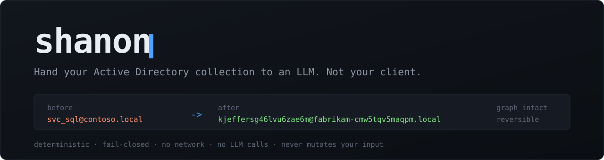

<p align="center">
  
</p>

<p align="center">
  <a href="https://github.com/Matixx22/shanon/actions/workflows/ci.yml"></a>
  <a href="LICENSE"></a>
  <a href="https://www.rust-lang.org"></a>
  <a href="#install"></a>
</p>

You want to ask an LLM about the attack paths in a SharpHound collection. You
cannot, because that file is your client's entire directory — every account,
every hostname, every group name, in clear.

**shanon** remaps every organization-bound identifier in the collection and
leaves the structure alone. The output is still SharpHound JSON, still loads in
BloodHound, and every graph cross-reference still points where it pointed — the
edges are what you are asking the model about, and they all survive. A local
mapping file turns its answer back into real names when it comes back.

## What it actually does

An excerpt from a real run over the synthetic collection in [`demo/`](demo/).
Every run picks a fresh random salt, so your pseudonyms will read differently —
pass `--map` once and `--reuse-map` after it to pin them.

**Before**

```json
{
  "name": "SVC_SQL@CONTOSO.LOCAL",
  "distinguishedname": "CN=svc_sql,OU=Service Accounts,DC=CONTOSO,DC=LOCAL",
  "email": "svc_sql@contoso.local",
  "description": "Runs MSSQLSvc on SQL01. Ticket owner: Helpdesk.",
  "serviceprincipalnames": ["MSSQLSvc/sql01.contoso.local:1433"],
  "hasspn": true
}
```

**After**

```json
{
  "name": "kjeffersg46lvu6zae6m@fabrikam-cmw5tqv5maqpm.LOCAL",
  "distinguishedname": "CN=kjeffersg46lvu6zae6m,OU=ppierce4d4g57h6caryy,DC=fabrikam-cmw5tqv5maqpm,DC=LOCAL",
  "email": "kjeffersg46lvu6zae6m@fabrikam-cmw5tqv5maqpm.local",
  "description": "[REDACTED:flnnjhdpxlthi]",
  "serviceprincipalnames": ["MSSQLSvc/HOST-87-GBWGEMP4OJUII.fabrikam-cmw5tqv5maqpm.local:1433"],
  "hasspn": true
}
```

Read what survived, because that is the point:

- `hasspn` is still `true`, the SPN is still an `MSSQLSvc/…:1433`, the DN is
  still a DN. **The account is still visibly kerberoastable**, which is what you
  wanted the model to notice.
- The account appears in four places across three collection members — its UPN,
  its email, its DN, the SPN's host — and every one of them got the *same*
  pseudonym, so the graph edges survive.
- Free text becomes an opaque `[REDACTED:…]` handle rather than a guess at what
  part of the sentence was sensitive.
- One line down, `Domain Admins` keeps RID 512 and its canonical name, because
  that is a global constant rather than something about your client — while its
  SID authority and domain are still remapped.

## Install

**Prebuilt binary** (Linux x86_64, macOS Apple Silicon) — pick the current tag
from [Releases](https://github.com/Matixx22/shanon/releases):

```sh
VERSION=v0.2.0
TARGET=x86_64-unknown-linux-gnu        # or aarch64-apple-darwin
BASE="https://github.com/Matixx22/shanon/releases/download/$VERSION"

curl -fsSLO "$BASE/shanon-$VERSION-$TARGET.tar.gz"
curl -fsSLO "$BASE/shanon-$VERSION-$TARGET.tar.gz.sha256"
shasum -a 256 -c "shanon-$VERSION-$TARGET.tar.gz.sha256"

tar xzf "shanon-$VERSION-$TARGET.tar.gz"
./shanon --version
```

**With cargo:**

```sh
cargo install --git https://github.com/Matixx22/shanon shanon-cli
```

**From source** (MSRV 1.97):

```sh
git clone https://github.com/Matixx22/shanon
cd shanon
cargo build --release          # binary at ./target/release/shanon
```

## Quickstart

```sh
# 1. dry run — tells you whether it would work, writes absolutely nothing
shanon inspect --input engagement.zip

# 2. the real thing
shanon anonymize --input engagement.zip --out ./anon
#   ->  ./anon/collection_anon.zip      send this one to the model
#   ->  ./anon/collection.map.json      reversal keys — keep local, never ship

# 3. fold the model's answer back to real identities
shanon restore --map ./anon/collection.map.json --input llm_findings.md
```

Send only the emitted `collection_anon.zip`, never its parent output directory —
that also holds the mapping file. Same input + same salt → byte-identical output.

Try it against the committed synthetic collection first:

```sh
shanon inspect --input demo/collection
```

## Why not just find-and-replace?

Because a directory is a graph, not a word list.

- **Identifiers are composite.** `MSSQLSvc/sql01.contoso.local:1433` is a service
  class, a host, a domain and a port. `S-1-5-21-…-1105` is an authority plus a
  RID that may or may not be a global constant. Each piece has to be decomposed
  and mapped on its own terms, and reassembled in the original shape, or the
  model stops recognizing what it is looking at.
- **The same thing appears under many spellings.** A user is a UPN here, a
  `samaccountname` there, a DN component, an email local part, a `PrincipalSID`
  in someone else's ACE. Miss the correspondence and the attack path
  disintegrates; the anonymized graph is then worse than useless, it is
  misleading.
- **A missed replacement is silent.** That is the failure that matters, and no
  regex tells you it happened. shanon independently re-derives the expected
  output for every string leaf and compares before anything is published; a
  single divergence aborts the run with no output written at all.
- **You need it back.** A one-way scrub leaves you translating the model's
  findings by hand, at which point you have re-created the mapping file, worse.

## Scope and honesty

> shanon **pseudonymizes**. It substantially lowers re-identification risk, but a
> collection is not legally anonymous afterward, and structure itself carries
> information — a 40,000-user domain with two DCs still looks like a
> 40,000-user domain with two DCs. [SECURITY.md](SECURITY.md) states the exact
> threat model and residual risks. Read it before you send anything anywhere.

**No network. No LLM calls. Never mutates your input.** The mapping file is
client-sensitive — keep it local, never ship it.

## Usage

### `anonymize`

```
shanon anonymize --input <zip|dir> --out <dir> [--map PATH] [--reuse-map PATH]
                 [--verbose-failures] [--progress | --no-progress]
```

| flag | required | meaning |
| --- | --- | --- |
| `--input` | yes | SharpHound collection: a `.zip` or a directory of `*.json` |
| `--out` | yes | output directory (must not already contain the target) |
| `--map` | no | where to write the reversal map (default `<out>/collection.map.json`) |
| `--reuse-map` | no | reuse salt + prior mappings so pseudonyms stay stable across collections |
| `--verbose-failures` | no | on an abort, print sanitized detail — every leak-gate finding, or the class, member, path and offender fingerprint of a mapping failure |
| `--progress` | no | draw the progress bar even when stderr is not a terminal |
| `--no-progress` | no | never draw the progress bar |

A run over a real collection takes minutes, so `anonymize` draws a progress bar
on stderr showing each phase — discovery, transform+verify, publish — with a
count and an ETA:

```
discovery        \  48,213 objects  0:41
transform+verify [##########--------------]  43%  41,902/96,426  1:12  eta 1:33
```

It is drawn only when stderr is a terminal, so redirected or piped stderr is
byte-identical to a run without it. Use the flags above to force either way.

```sh
# stable pseudonyms across two collections of the same environment
shanon anonymize --input dc1.zip --out ./anon1 --map ./env.map.json
shanon anonymize --input dc2.zip --out ./anon2 --reuse-map ./env.map.json
```

Output members are named `member-NNNNN.json`: the collector's filenames are
themselves organization-bound, so they do not survive either.

### `inspect`

```
shanon inspect --input <zip|dir> [--progress | --no-progress]
```

A dry run: same discovery, transform and leak-gate verification as `anonymize`,
then stop. **Nothing is written** — no output collection, no mapping file, no
staging directory — so it is safe to point at a collection that must not leave
the machine. Exit `0` if the collection would anonymize cleanly, `1` if it would
abort.

```sh
shanon inspect --input engagement.zip
```

```
members: 7 read, 7 accepted, 0 skipped
objects: 5752

collections:
  users                    type=User           version=6          objects=4000
  computers                type=Computer       version=6          objects=800
  azbase                   type=Unknown        version=6          objects=12  <- unrecognized, contents anonymized opaquely

audit codes:
  malformed-source-value: 600
  unknown-key-path: 33106

unknown field paths (21 distinct):
       800  data[].localgroups[]["[redacted:wx5fedc6e5w56]"]

verdict: this collection would anonymize cleanly
```

Every line is a count, a synthetic `member-NNNNN.json` label, a canonical field
path or a BLAKE2b-6 fingerprint — never a source value and never a source
filename — so the report can be shared for a collection that cannot be. That
also means the *names* of unmodeled fields appear as fingerprints rather than
in clear: the path tells you where the drift is, the digest tells you it is the
same field each time.

Reach for it when a run aborts, when a new collector version is in play, or
before spending minutes on a collection that will not finish.

### `restore`

```
shanon restore --map <map.json> [--lookup FAKE | --forward REAL | --input FILE]
```

| flag | meaning |
| --- | --- |
| `--map` | the `collection.map.json` produced by `anonymize` (required) |
| `--lookup` | resolve one pseudonym → real value |
| `--forward` | resolve one real value → pseudonym |
| `--input` | bulk mode: substitute every known pseudonym in a file (omit to read stdin) |

```sh
# single pseudonym -> real
shanon restore --map ./anon/collection.map.json --lookup kjeffersg46lvu6zae6m
#   accounts: svc_sql

# bulk: de-anonymize an LLM answer that quotes pseudonyms back at you
shanon restore --map ./anon/collection.map.json --input llm_findings.md
```

`--lookup` and `--forward` resolve one mapped **component** — an account label, a
domain label, a hostname — because that is the granularity the registry binds.
A composite string such as a full UPN or SPN goes through `--input`, which
substitutes every component it recognizes.

### Exit codes

| code | condition |
| --- | --- |
| `0` | success — for `inspect`, the collection would anonymize cleanly |
| `1` | leak-gate abort, invalid mapping data, or I/O error — no output written; for `inspect`, the collection would abort |
| `2` | pre-flight refusal (e.g. `--out` already holds a map, or conflicting flags) |

## What gets scrubbed

- Names (user/group/computer/OU/GPO/container), UPNs, SPNs, DNS hostnames, emails
- Organization-specific SID authority values and custom GUIDs
- Domain FQDNs and organization-specific DN components
- Role, product, OS, and vendor fingerprints
- Custom certificate templates, enterprise OIDs, CA names, and certificate material
- Free text and opaque values → deterministic `[REDACTED:…]` mappings
- The *names* of fields no rule models, not only their values — a custom AD
  attribute is organization-bound in its key as much as its contents

That last one currently catches a few standard SharpHound fields the rule table
does not model yet, including `IsDeleted`, `IsACLProtected`,
`Properties.whencreated` and `FailureReason`: they come back renamed rather than
dropped. No graph edge depends on them, so the collection still loads and still
reasons correctly — but it is not a byte-for-byte SharpHound document. `inspect`
lists exactly which paths a given collection hit.

## What is preserved

Only catalog-proven, globally invariant constants are preserved — and only at the
specific object type and field path listed in the catalog. Examples:

- `Domain Admins` retains RID 512 and its canonical account name; its SID
  authority and domain name are still mapped.
- Fixed default-GPO GUIDs, standard protocol/EKU OIDs, and built-in
  certificate-template names, at catalog-permitted paths only.
- Feature/vendor defaults (`Hyper-V Administrators`, `Vault Administrators`) and
  anything custom are mapped, not preserved.

## Safety model

shanon is fail-closed. It classifies every object, freezes a verification state,
transforms each member by object type and field path, then independently verifies
the result against the frozen registry before writing. Verified members go to a
private staging area and are published by atomic rename only after all pass;
existing destinations are refused. Errors report a sanitized fingerprint, never
the source secret or filename.

See [SECURITY.md](SECURITY.md) for the full threat model and what shanon does
**not** protect against.

## Development

```
crates/shanon-core   library: catalog, policy, registry, engine, verification, pipeline
crates/shanon-cli    the `shanon` binary (anonymize / inspect / restore)
demo/collection      synthetic collection behind the README's before/after
assets/              banner
```

```sh
cargo fmt --all --check
cargo clippy --workspace --all-targets -- -D warnings
cargo test --workspace
```

## Contributing

Contributions are welcome — see [CONTRIBUTING.md](CONTRIBUTING.md) for the build,
test, and PR workflow, and [CODE_OF_CONDUCT.md](CODE_OF_CONDUCT.md). A real
identifier that survives a run is a **security bug**: report it privately per
[SECURITY.md](SECURITY.md), never as a public issue.

## License

MIT © Mateusz Suchocki. See [LICENSE](LICENSE).
